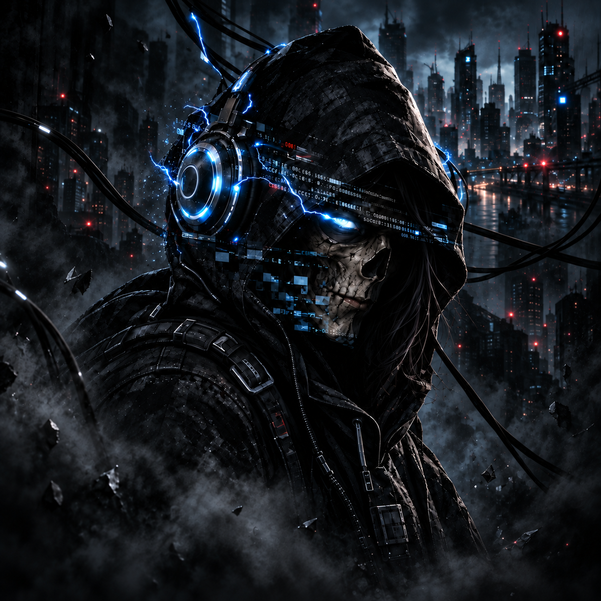

<div align="center">



### `RandomLinoge // signal acquired // identity unresolved`

Security research. Adversarial systems. Strange hardware.<br>
Building at the boundary between infrastructure, radio, cryptography, and play.

[](https://wdgwars.pl/)

</div>

---

```text
GITHUB NODE ........ RandomLinoge
SUBJECT ............ Bak3n3k0
CLASSIFICATION ..... [REDACTED]
OPERATING MODE ..... observe / investigate / evidence
LAST KNOWN STATE ... still compiling
```

## What survives the redaction

I work where defensive security meets the urge to take systems apart.

My interests include identity infrastructure, detection engineering, malware analysis, adversary simulation, post-quantum cryptography, embedded security, wireless protocols, and CTF challenge design. I am especially interested in systems that cross boundaries: software touching radios, cryptography touching hardware, and technical evidence colliding with unreliable interfaces.

The biography is intentionally absent. The work is the attribution layer.

## Current transmissions

```yaml
research:
  - post-quantum OpenPGP and experimental PKI
  - malware analysis, YARA, Sigma, and forensic workflows
  - identity, Active Directory, XDR, and detection engineering

hardware:
  - ESP32 and nRF52 security instruments
  - LoRa and Meshtastic experiments
  - Zigbee, Thread, and IoT protocol research
  - portable radio and wardriving interfaces

constructs:
  - physical and radio-frequency CTF challenges
  - adversarial puzzles with multiple evidence layers
  - cyberpunk interfaces for small displays
```

## Selected operations

| Codename | Domain | Status |
| :--- | :--- | :---: |
| **OpenPGP Quantum Guard** | PQC experimentation, key inspection, compatibility testing | `ACTIVE` |
| **PQC Certificate Guard** | Post-quantum certificate research and validation | `ACTIVE` |
| **Atomic Red Team Contributions** | Safe adversary-emulation tests for KeePassXC extraction and npm postinstall execution | `VALIDATED` |
| **BlackChannel Sentinel** | FREE-WILi OG and ESP32-C6 radio-event investigation console | `FIELD TEST` |
| **Wardriving Field Node** | Portable Wi-Fi survey and evidence-collection device | `BUILDING` |
| **The Mad Hatter's Mesh Party** | LoRa and Meshtastic hardware CTF | `TRANSMITTING` |
| **Hallucination Key** | Dual-panel physical security puzzle | `CONTAINED` |
| **Through the Cipherglass** | Cryptographic image-decoding challenge | `SOLVABLE?` |
| **ESP32 Mini Chess** | One-button chess engine and tactical HUD on an 80×160 IPS display | `PLAYABLE` |

<details>
<summary><strong>Extended project archive</strong></summary>

<br>

### Security, networks, and cryptography

| Project | Focus | Stage |
| :--- | :--- | :---: |
| **RuView** | Radio and signal-visibility experimentation | `LAB` |
| **Pi-hole Lab** | DNS filtering, network visibility, and telemetry | `DEPLOYED` |
| **Threat Modeling** | STRIDE, trust boundaries, evidence strength, and safety-impact analysis | `ACTIVE` |
| **Cybersec Stress Dashboard** | Security-operations pressure and workload visualization | `PROTOTYPE` |
| **Scraper Designs** | Structured collection and data-extraction experiments | `LAB` |
| **Encryption Puzzles** | Layered cryptographic challenges and solver design | `ACTIVE` |
| **PGP / GnuPG Party** | OpenPGP interoperability, signing, and key-exchange experiments | `PREPARING` |
| **TAMI LAN Party** | Local security, networking, and key-signing event work | `PREPARING` |

### Embedded systems and strange hardware

| Project | Focus | Stage |
| :--- | :--- | :---: |
| **ESP32-CAM Lab** | Camera initialization, MJPEG streaming, and embedded diagnostics | `LAB` |
| **Nixie Tube Clock** | High-voltage timepiece and display electronics | `PROJECT` |
| **Nixie Tube Watch** | Four-tube wearable watch concept with a 160–170 V supply | `PLANNING` |
| **Meshtastic Bot Network** | Autonomous encrypted-channel bots across LoRa nodes | `FIELD TEST` |
| **OLED Novel Reader** | ESP32 reader interface for small monochrome OLED displays | `PROTOTYPE` |
| **Rich Shield TWO** | Embedded control, sensor, and display experiments | `LAB` |
| **USB Explorer 200 Repurpose** | Hardware reuse and USB-focused experimentation | `PLANNING` |

### Interactive systems, games, and narrative artifacts

| Project | Focus | Stage |
| :--- | :--- | :---: |
| **Axiometa Genesis** | Experimental narrative-system project | `PROJECT` |
| **Graphical Cthulhu Game** | Graphical cosmic-horror game | `PROJECT` |
| **Grief Redesign** | Visual language for grief, memory, and absence | `ITERATING` |
| **Grief Ritual** | Interactive ritual and remembrance experience | `PROJECT` |
| **Parallel Universes Graph** | Interactive graph for branching realities | `PROJECT` |
| **Reality Analyzer** | Experimental interface for inspecting uncertain realities | `PROJECT` |
| **2.5 Cyberpunk Games** | Small cyberpunk game experiments | `COLLECTION` |
| **Bak3n3k0 Graphic Novel #1** | First long-form visual narrative under the Bak3n3k0 identity | `IN PROGRESS` |

</details>

## Known interfaces

`Python` · `PowerShell` · `C/C++` · `KQL` · `YARA` · `Sigma` · `Docker` · `Git`

`ESP32` · `nRF52840` · `LoRa` · `Meshtastic` · `Zigbee` · `Thread` · `TLS` · `OpenPGP`

`DFIR` · `Malware Analysis` · `Threat Hunting` · `Detection Engineering` · `Adversary Simulation`

## Field notes

```text
[+] Assume the interface is lying.
[+] Treat confidence as data, never proof.
[+] Preserve the evidence before touching the system.
[+] If a protocol crosses the air gap, listen to the silence around it.
[+] Every rabbit hole is an attack surface.
```

<details>
<summary><strong>Declassified fragments</strong></summary>

<br>

- Offensive and defensive security research
- Enterprise-scale security architecture and operations
- Hands-on CTF, malware, embedded, and wireless experimentation
- A persistent preference for evidence over certainty

</details>

---

<div align="center">

<sub><code>EOF // the remaining sectors are intentionally unreadable</code></sub>

</div>
